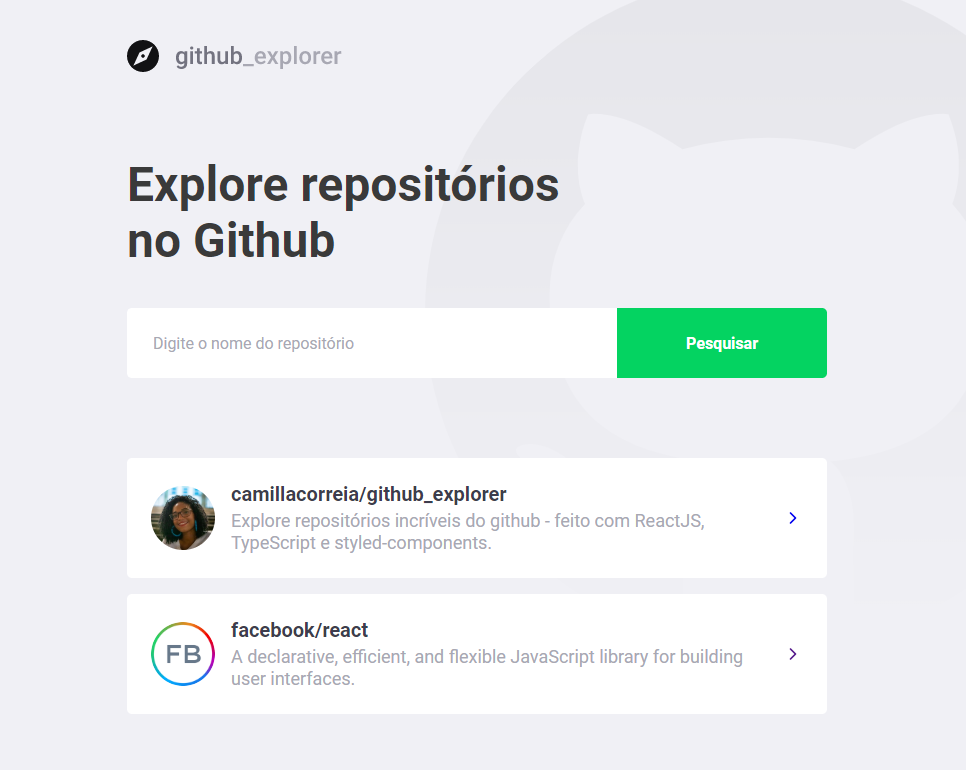
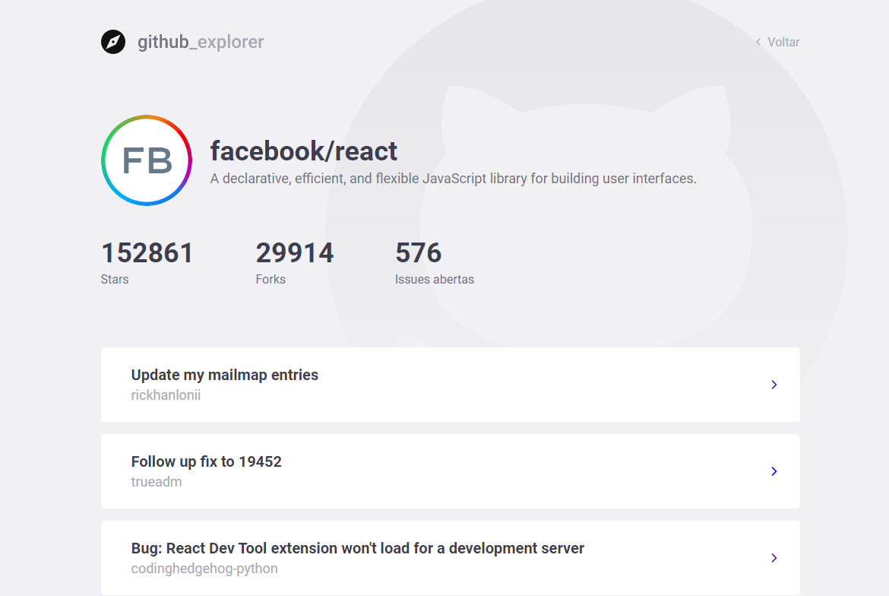
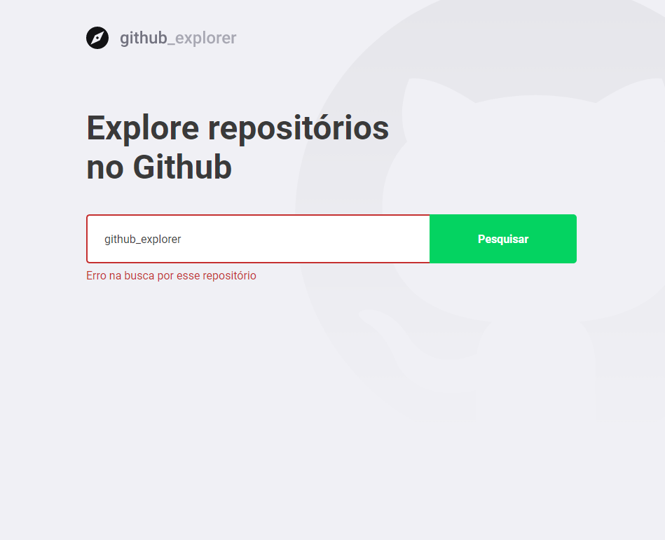

<br />
<p align="center">
  <a>
    
  </a>
</p>

<p align="center">
  Explore repositórios incríveis do github - feito com ReactJS, TypeScript e styled-components.
</p>

## Features

* Explore os repositórios do github e adicione-os à sua lista
* Veja a lista de issues do repositório
* Veja a lista de forks do repositório
* Veja a lista de stargazers do repositório

<br>
<p align="center">
  
</p>
<br>
<p align="center">
  
</p>
<br>
<p align="center">
  
</p>

<br>

## Instalação

Primeiramente, clone o repositório.

```
  git clone https://github.com/camillacorreia/github_explorer.git
```

Execute os seguintes scripts para executar o aplicativo no modo de desenvolvimento.

```
  // Install the dependencies
  yarn install
  
  // Start the application
  // yarn start
```

---

Feito com 💜 por [Camilla Correia](https://www.linkedin.com/in/camilla-correia-3203a3139/)
